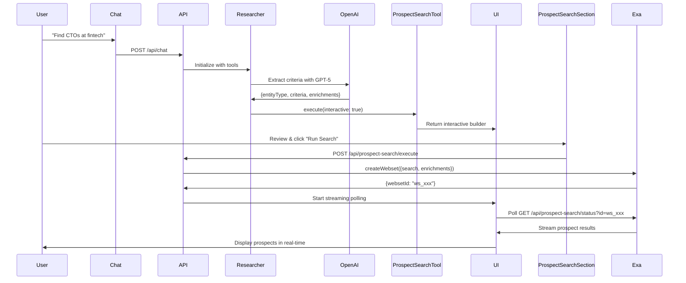

# 🏛️ HermesAI Technical Architecture

**Last Updated:** September 30, 2025  
**Status:** Production Architecture Review

---

## 📋 Table of Contents

1. [System Overview](#system-overview)
2. [AI SDK v5 Integration](#ai-sdk-v5-integration)
3. [Tool Calling Architecture](#tool-calling-architecture)
4. [Prospect Search Workflow](#prospect-search-workflow)
5. [State Management](#state-management)
6. [Exa Websets Integration](#exa-websets-integration)
7. [OpenAI Integration](#openai-integration)
8. [Email Generation](#email-generation)
9. [Data Validation (Zod)](#data-validation-zod)
10. [Performance & Scaling](#performance--scaling)

---

## 1. System Overview

### Architecture Diagram

```
User Input
    ↓
Chat Component (useChat from AI SDK v5)
    ↓
POST /api/chat
    ↓
createToolCallingStreamResponse()
    ↓
researcher() agent with tools:
    ├── prospect_search → Exa Websets API
    ├── search → SearXNG/Tavily
    ├── ask_question → Interactive UI
    ├── scrape_site → Web scraping
    └── email_drafter → Email UI
    ↓
Streaming UI Updates
    ↓
User sees results in real-time
```

### Tech Stack

| Layer | Technology | Purpose |
|-------|-----------|---------|
| **Frontend** | Next.js 15 (App Router) + React 19 | UI Framework |
| **AI SDK** | Vercel AI SDK v5 | Streaming, tool calling |
| **LLMs** | OpenAI (GPT-5), Anthropic (Claude 3.5+) | AI Processing |
| **Validation** | Zod | Type-safe schemas |
| **Database** | Supabase (PostgreSQL) | Data persistence |
| **Search** | Exa Websets API | Prospect discovery |
| **State** | React useState + useChat | Client-side state |
| **Styling** | Tailwind CSS | UI Design |

---

## 2. AI SDK v5 Integration

### Key Changes from v4

AI SDK v5 introduced major breaking changes:

```typescript
// ❌ v4 (OLD)
const { messages, append, input, setInput } = useChat()

// ✅ v5 (NEW)
const { messages, sendMessage } = useChat()
// NO built-in input management!
```

### Our Implementation

**File:** `components/chat.tsx`

```typescript
const [inputValue, setInputValue] = useState('')
const [uiData, setUiData] = useState<JSONValue[]>([])

const chatHook = useChat({
  id: CHAT_ID,
  body: { id },
  onFinish: () => {
    window.history.replaceState({}, '', `/search/${id}`)
    window.dispatchEvent(new CustomEvent('chat-history-updated'))
  },
  onData: (part: any) => {
    // Normalize v5 custom chunks to flat shape
    if (part?.type === 'message-metadata' && part?.messageMetadata?.type === 'tool_call') {
      setUiData(prev => [...prev, { type: 'tool_call', data: part.messageMetadata.data }])
    } else if (part?.type?.startsWith?.('data-')) {
      const normalizedType = part.type.replace('data-', '')
      setUiData(prev => [...prev, { type: normalizedType, data: part.data }])
    } else if (data) {
      setUiData(prev => [...prev, data])
    }
  },
  experimental_throttle: 100
})

// Manual input management
const input = inputValue
const setInput = setInputValue
```

**Key Insights:**
- v5 doesn't manage `input` state → we manage it manually
- Custom data chunks must start with `data-` prefix
- `onData` callback normalizes streaming events
- `experimental_throttle` prevents UI flooding

---

## 3. Tool Calling Architecture

### Native Tool Calling Flow

**File:** `lib/streaming/create-tool-calling-stream.ts`

```typescript
export function createToolCallingStreamResponse(config: BaseStreamConfig) {
  return createUIMessageStreamResponse({
    stream: createUIMessageStream({
      async execute({ writer }) {
        // 1. Convert UI messages to CoreMessage format
        const modelMessages = cleanedMessages.map(convertUIMessageToCoreMessage)
        
        // 2. Initialize researcher agent with tools
        const { model, system, messages, tools, experimental_transform } = researcher({
          messages: [...modelMessages, ...newMessages],
          model: config.model.id,
          searchMode: config.searchMode
        })
        
        // 3. Stream with tool execution
        const result = streamText({
          model,
          system,
          messages,
          tools,
          experimental_transform,
          onFinish: async ({ response }) => {
            await handleStreamFinish({
              responseMessages: response.messages,
              originalMessages: config.messages,
              model: config.model.id,
              chatId: config.chatId,
              dataStream,
              userId: config.userId
            })
          }
        })
        
        // 4. Pipe to writer
        result.mergeIntoDataStream(writer)
      }
    })
  })
}
```

**Tool Execution Steps:**

1. **Tool Call Detection:** AI model decides to call a tool
2. **Schema Validation:** Zod validates tool inputs
3. **Execution:** Tool runs (e.g., Exa API call)
4. **Result Streaming:** Results stream back to UI
5. **State Update:** UI components re-render

---

## 4. Prospect Search Workflow

### End-to-End Flow



### Prospect Search Tool

**File:** `lib/tools/prospect-search.ts`

```typescript
export function createProspectSearchTool(model: string) {
  return tool({
    description: 'Search for qualified prospects using AI-powered research.',
    inputSchema: prospectSearchSchema,
    execute: async ({ query, targetCount = 25, interactive = true, previewOnly = false }) => {
      
      if (interactive) {
        // Generate UI configuration using GPT-5
        const websetPlan = await generateObject({
          model: getModel('openai:gpt-5'),
          schema: websetPlanSchema,
          prompt: `Create an Exa Websets plan for: "${query}"`
        })
        
        // Return interactive UI props
        return {
          type: 'interactive_ui',
          component: 'ProspectSearchBuilder',
          props: {
            initialCriteria: websetPlan.object.searchCriteria.map(c => ({
              label: c.description,
              value: c.description,
              type: c.type
            })),
            initialEnrichments: websetPlan.object.enrichments.map(e => ({
              label: e.name,
              value: e.name.toLowerCase().replace(/\s+/g, '_'),
              required: e.required
            })),
            initialEntityType: websetPlan.object.entityType,
            initialCount: targetCount,
            originalQuery: query
          }
        }
      }
      
      // Immediate execution (non-interactive)
      const exaClient = createExaWebsetsClient()
      const webset = await exaClient.createWebset({
        search: websetSearchConfig,
        enrichments: websetEnrichments
      })
      
      return {
        type: 'streaming_search',
        websetId: webset.id,
        status: 'created'
      }
    }
  })
}
```

**Key Features:**
- **Interactive Mode (default):** Returns UI builder with AI-extracted criteria
- **Immediate Mode:** Directly creates Exa webset
- **GPT-5 Integration:** Intelligently extracts search parameters

---

## 5. State Management

### Client-Side State

**Component:** `components/chat.tsx`

```typescript
// Message state (managed by AI SDK)
const { messages, sendMessage, status } = useChat()

// UI data state (custom)
const [uiData, setUiData] = useState<JSONValue[]>([])

// Campaign progress state
const [showProgressTracker, setShowProgressTracker] = useState(false)
const [currentCampaignStep, setCurrentCampaignStep] = useState(1)
const [campaignPercent, setCampaignPercent] = useState(20)
```

### Streaming Events

**Event Types:**
```typescript
type StreamEvent = 
  | { type: 'tool_call', data: { toolName: string, args: string } }
  | { type: 'tool_result', data: { result: string } }
  | { type: 'pipeline', data: { stepNumber: number, percent: number } }
  | { type: 'related-questions', data: { items: string[] } }
  | { type: 'text-delta', textDelta: string }
```

**Event Handling:**
```typescript
onData: (part: any) => {
  if (part?.type === 'message-metadata' && part?.messageMetadata?.type === 'tool_call') {
    setUiData(prev => [...prev, { type: 'tool_call', data: part.messageMetadata.data }])
  } else if (part?.type?.startsWith?.('data-')) {
    const normalizedType = part.type.replace('data-', '')
    setUiData(prev => [...prev, { type: normalizedType, data: part.data }])
  }
}
```

---

## 6. Exa Websets Integration

### Client Setup

**File:** `lib/clients/exa-websets.ts`

```typescript
import Exa from 'exa-js'

export function createExaWebsetsClient() {
  if (!process.env.EXA_API_KEY) {
    throw new Error('EXA_API_KEY not configured')
  }
  return new Exa(process.env.EXA_API_KEY)
}
```

### Webset Creation

```typescript
export async function createWebset(params: {
  search: WebsetSearchConfig
  enrichments: WebsetEnrichment[]
}) {
  const exa = createExaWebsetsClient()
  
  const webset = await exa.websets.create({
    search: {
      query: params.search.query,
      count: params.search.targetCount,
      entity: { type: params.search.entityType },
      criteria: params.search.allCriteria.map(c => ({
        description: c.value,
        successRate: 75
      }))
    },
    enrichments: params.enrichments.map(e => ({
      title: e.title,
      description: e.description,
      format: e.format || 'text',
      instructions: e.instructions
    }))
  })
  
  return webset
}
```

### Polling for Results

**File:** `app/api/prospect-search/status/route.ts`

```typescript
export async function GET(req: NextRequest) {
  const websetId = req.nextUrl.searchParams.get('id')
  const exa = createExaWebsetsClient()
  
  const webset = await exa.websets.get(websetId)
  
  // Check status
  if (webset.status === 'completed') {
    const items = await exa.websets.listItems(websetId, { limit: 1000 })
    const prospects = items.map(convertToProspect)
    
    return NextResponse.json({
      status: 'completed',
      prospects,
      totalFound: items.length
    })
  }
  
  return NextResponse.json({
    status: webset.status,
    progress: webset.progress || 0
  })
}
```

**Polling Strategy:**
- Poll every 2 seconds
- Max 5 minutes timeout
- Exponential backoff on errors

---

## 7. OpenAI Integration

### Query Optimization

**File:** `lib/tools/prospect-search.ts`

```typescript
const websetPlanSchema = z.object({
  entityType: z.enum(['person', 'company']),
  searchCriteria: z.array(z.object({
    description: z.string(),
    type: z.enum(['job_title', 'company_type', 'industry', 'location', 'technology', 'activity', 'other']),
    successRate: z.number().min(50).max(95)
  })).max(5),
  enrichments: z.array(z.object({
    name: z.string(),
    description: z.string(),
    format: z.enum(['text', 'json', 'number']),
    instructions: z.string(),
    required: z.boolean()
  }))
})

const websetPlan = await generateObject({
  model: getModel('openai:gpt-5'),
  schema: websetPlanSchema,
  prompt: `Create an Exa Websets plan for: "${query}"
  
  Generate:
  1. Entity type (person or company)
  2. Up to 5 categorized search criteria with types
  3. Enrichment fields with clear names and required status
  
  Example for "VPs of Engineering at fintech companies":
  - Criteria: [
      {description: "Person holds VP of Engineering title", type: "job_title", successRate: 90},
      {description: "Person works at a fintech company", type: "company_type", successRate: 85}
    ]
  - Enrichments: [
      {name: "Full Name", description: "Person's name", format: "text", instructions: "Extract first and last name", required: true}
    ]
  `,
  temperature: 0.3
})
```

**Key Features:**
- **Structured Output:** Uses `generateObject` for type-safe responses
- **Zod Validation:** Schema ensures valid Exa API calls
- **Low Temperature:** 0.3 for consistent, predictable outputs

---

## 8. Email Generation

### Current Implementation

**File:** `lib/tools/email-drafter.ts`

```typescript
export function createEmailDrafterTool() {
  return tool({
    description: 'Open the interactive email drafter UI to create templates and personalize outreach.',
    inputSchema: drafterSchema,
    execute: async ({ prospects = [], summary } = {}) => {
      return {
        type: 'drafter_ui',
        component: 'InteractiveEmailDrafter',
        props: {
          prospects,
          searchSummary: summary ?? null,
          step: 3,
          totalSteps: 5
        },
        message: 'Opening the email drafter with templates and personalization controls.'
      }
    }
  })
}
```

**⚠️ ISSUE:** Email generation logic is **NOT implemented yet!**

**Required Implementation:**
```typescript
// TODO: Implement actual email generation
const generatePersonalizedEmail = async (prospect: Prospect, template: string) => {
  const { generateText } = await import('ai')
  const { getModel } = await import('@/lib/utils/registry')
  
  const result = await generateText({
    model: getModel('openai:gpt-5'),
    prompt: `Generate a personalized cold email using this template: ${template}
    
    Prospect details:
    - Name: ${prospect.fullName}
    - Job Title: ${prospect.jobTitle}
    - Company: ${prospect.company}
    - Recent Activity: ${prospect.recentActivity}
    
    Requirements:
    - Keep it under 100 words
    - Focus on value prop
    - Include specific personalization
    - End with clear CTA
    `,
    temperature: 0.7
  })
  
  return result.text
}
```

---

## 9. Data Validation (Zod)

### Schema Examples

**Prospect Search Schema:**
```typescript
const prospectSearchSchema = z.object({
  query: z.string().describe('Natural language description of prospects'),
  targetCount: z.number().optional().default(25).describe('Number of prospects to find'),
  interactive: z.boolean().optional().default(true).describe('Show interactive UI'),
  previewOnly: z.boolean().optional().default(false).describe('Run search on 1 prospect first'),
  entityType: z.enum(['person','company']).optional().default('person')
})
```

**Tool Call Validation:**
```typescript
function parseToolCallXml<T>(xml: string, schema?: z.ZodType<T>): ToolCall<T> {
  const toolCallContent = getTagContent(xml, 'tool_call')
  const tool = getTagContent(toolCallContent, 'tool')
  const parametersXml = getTagContent(toolCallContent, 'parameters')
  
  const rawParameters: Record<string, string> = {}
  if (schema instanceof z.ZodObject) {
    Object.keys(schema.shape).forEach(key => {
      const value = getTagContent(parametersXml, key)
      if (value) rawParameters[key] = value
    })
  }
  
  const parsed = schema.parse(rawParameters) // Throws if invalid
  return { tool, parameters: parsed }
}
```

**Benefits:**
- ✅ Type safety at runtime
- ✅ Automatic error messages
- ✅ OpenAPI-compatible schemas
- ✅ No manual validation code

---

## 10. Performance & Scaling

### Current Bottlenecks

1. **Exa Websets Polling:** Polls every 2 seconds (could be optimized with WebSockets)
2. **No Caching:** Every search hits Exa API (should cache results)
3. **Sequential Processing:** Prospects processed one-by-one (could be parallel)
4. **No CDN:** Static assets served from origin

### Optimization Opportunities

#### 1. Implement Result Caching
```typescript
import { Redis } from '@upstash/redis'

const redis = new Redis({ /* config */ })

async function getCachedWebset(websetId: string) {
  const cached = await redis.get(`webset:${websetId}`)
  if (cached) return JSON.parse(cached as string)
  
  const webset = await exa.websets.get(websetId)
  await redis.setex(`webset:${websetId}`, 3600, JSON.stringify(webset))
  return webset
}
```

#### 2. Parallel Prospect Enrichment
```typescript
const prospects = await Promise.all(
  items.map(async (item) => {
    const enrichments = await Promise.all([
      enrichEmail(item),
      enrichLinkedIn(item),
      enrichPhone(item)
    ])
    return { ...item, enrichments }
  })
)
```

#### 3. WebSocket for Real-Time Updates
```typescript
// Instead of polling
const ws = new WebSocket(`wss://api.exa.ai/websets/${websetId}/stream`)
ws.onmessage = (event) => {
  const prospect = JSON.parse(event.data)
  addProspect(prospect)
}
```

---

## 🚨 Critical Issues Found

### 1. **Email Generation Not Implemented**
- Tool returns UI props only
- No actual LLM-based personalization
- **Fix:** Implement `generatePersonalizedEmail()` function

### 2. **No Error Boundaries**
- Prospect search crashes can break entire UI
- **Fix:** Add `<ErrorBoundary>` around critical components

### 3. **Rate Limiting Disabled Without Redis**
- If Redis not configured, rate limits don't work
- **Fix:** Add in-memory fallback (see `lib/utils/rate-limit.ts`)

### 4. **No Input Sanitization**
- User inputs passed directly to LLMs
- **Fix:** Sanitize inputs before API calls

### 5. **Streaming Memory Leak**
- `uiData` array grows indefinitely
- **Fix:** Implement cleanup on unmount 

---

## 📊 Production Readiness Checklist

### Backend
- [x] AI SDK v5 integration
- [x] Tool calling architecture
- [x] Exa Websets integration
- [x] Zod validation
- [x] Rate limiting (conditional)
- [ ] Email generation logic
- [ ] Error boundaries
- [ ] Input sanitization
- [ ] Result caching
- [ ] WebSocket support

### Database
- [x] Schema defined
- [x] RLS policies
- [x] User authentication
- [ ] Indexes optimized
- [ ] Backup strategy
- [ ] Migration rollback plan

### Monitoring
- [ ] Sentry error tracking
- [ ] Vercel Analytics
- [ ] Custom metrics (Exa usage, email sends)
- [ ] Logging aggregation
- [ ] Alert thresholds

---

## 🏁 Next Steps

### Priority 1 (Blockers)
1. Implement email generation with OpenAI
2. Add error boundaries to prospect search
3. Set up Sentry error tracking

### Priority 2 (High Impact)
4. Implement result caching
5. Add WebSocket streaming
6. Optimize database queries

### Priority 3 (Polish)
7. Add comprehensive logging
8. Implement A/B testing for emails
9. Build analytics dashboard

---

_This document is living and should be updated as the architecture evolves._
